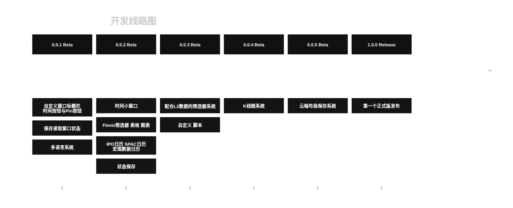

# DTBox

## 简介
是一款用于美股日内交易的工具软件，提供实时行情、数据分析等功能。

## 功能
- 保存布局: 云端保存布局，支持多设备同步。
- 找票系统: 支持L2数据找票
- 实时行情：支持多种数据源，包括股票、期货、期权等，提供实时行情数据。
- 数据分析：提供多种数据分析工具，包括K线图、MACD、RSI等，帮助用户进行技术分析。

## 路线图

```mermaid
---
config:
  theme: redux-dark
---
timeline
  title 开发线路图
  0.0.1 Beta
    : 自定义窗口标题栏 时间按钮与Pin按钮
    : 保存读取窗口状态
    : 多语言系统
  0.0.2 Beta
    : 时间小窗口
    : Finviz筛选器 表格 图表
    : IPO日历 SPAC日历 宏观数据日历
    : 状态保存
  0.0.3 Beta
    : 配合L2数据的筛选器系统
    : 自定义 脚本
  0.0.4 Beta
    : K线图系统
  0.0.5 Beta
    : 云端布局保存系统
  1.0.0 Release
    : 第一个正式版发布
```
