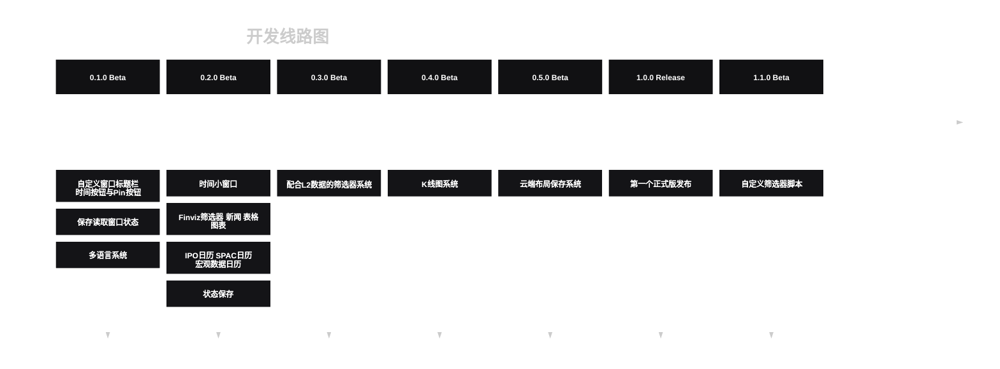

# DTBox

## 简介
是一款用于美股日内交易的工具软件，提供实时行情、数据分析等功能。

## 路线图

```mermaid
---
config:
  theme: redux-dark
---
timeline
  title 开发线路图
  0.1.0 Beta
    : 自定义窗口标题栏 时间按钮与Pin按钮
    : 保存读取窗口状态
    : 多语言系统
  0.2.0 Beta
    : 时间小窗口
    : Finviz筛选器 新闻 表格 图表
    : IPO日历 SPAC日历 宏观数据日历
    : 状态保存
  0.3.0 Beta
    : 配合L2数据的筛选器系统
  0.4.0 Beta
    : K线图系统
  0.5.0 Beta
    : 云端布局保存系统
  1.0.0 Release
    : 第一个正式版发布
  1.1.0 Beta
    : 自定义筛选器脚本
```

API 数据特别感谢 Finviz提供 文档`https://finviz.com/api_explanation.ashx`

