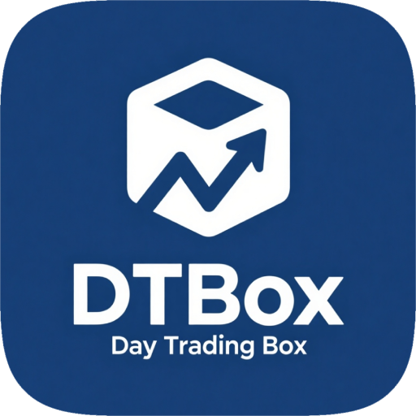

# DTBox

  

## 状态码

| 代码 | 含义 |
| --- | --- |
| 0 | 成功 |
| -1 | 未知错误 |
| -2 | 数据库查询错误 |
| -3 | 数据库修改错误 |
| -4 | Hash错误 |
| -5 | Cookie提取错误 |
| -6 | 解析错误 |
| -101 | Authorization 解析格式错误 |
| -102 | 未提供 Authorization |
| -103 | Authorization 无效/过期 |
| -104 | 未提供 JWT Claims |
| -201 | 未找到 Refresh Token |
| -202 | Refresh Token 过期 |
| -203 | Refresh Token 错误 |
| -301 | 用户不存在 |
| -302 | 密码错误 |

## 简介(新手项目)
是一款用于美股日内交易的工具软件，提供实时行情、数据分析等功能。
## 软件仅限个人交流学习/投资研究，请于下载后的 24 小时内卸载！
## 如果本项目存在侵犯您的合法权益的情况，请及时与开发者联系，开发者将会及时删除有关内容。
