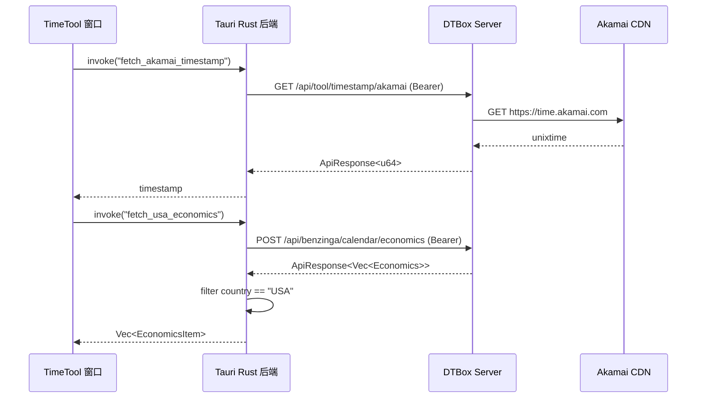

# DTBox Client

DTBox 桌面客户端，基于 Tauri 2 构建，负责用户登录、注册和本地凭证管理。用户一次登录后，下次启动可免密自动登录。

## 核心功能

- **用户注册**：调用 Server API 创建账号
- **用户登录**：通过 Tauri 原生 HTTP（Rust 侧 `reqwest`）调用 Server API，无浏览器跨域限制
- **免密自动登录**：登录后 RefreshToken 存入系统密钥库，下次启动时自动刷新 AccessToken，无需重新输入密码
- **凭证安全存储**：使用 keyring-rs 将 RefreshToken 存入系统密钥库，AccessToken 仅存内存
- **本地 WebSocket 服务**：启用随机端口，供 Web 端连接以接收和刷新 AccessToken
- **手动打开 Web 端**：通过"Open Web"按钮打开远程 Web 页面，URL 使用用户配置的 Server 地址
- **TimeTool 悬浮窗口**：独立置顶窗口，显示 Akamai 时间戳（每秒递增）和 Benzinga 美国经济数据
- **AccessToken 自动刷新**：Rust 侧 `api.rs` 封装 `get_with_auth` / `post_with_auth`，API 调用失败时自动通过 RefreshToken 刷新并重试

## 页面流程

```
┌───────────┐    Save    ┌───────────┐    Login     ┌────────────────┐
│  Settings  │ ────────► │   Login   │ ───────────► │   Logged In    │
│            │ ◄──────── │           │               │                │
│ Host:Port  │  Edit     │ Username  │               │ Open Web       │
│            │           │ Password  │               │ Logout         │
└───────────┘           │           │               │ TimeTool ──────┼──► 新窗口
                         │           │               │                │    ┌──────────┐
                         │ Register  │               └────────────────┘    │ TimeTool │
                         ▼           ▲                                     │          │
                    ┌───────────┐   │                                     │ hh:mm:ss │
                    │ Register  │───┘                                     │ USA 经济  │
                    │           │                                         └──────────┘
                    │ Username  │
                    │ Password  │
                    │ Confirm   │
                    └───────────┘
```

## 认证流程详解

```
┌──────────┐      POST /api/user/login       ┌──────────┐
│  用户     │ ──  username + password ───────►│  Server  │
│  (GUI)   │◄── access_token + refresh_token │          │
└────┬─────┘       + user_id                 └──────────┘
     │
     │ refresh_token + user_id → 存入 keyring-rs（系统密钥库）
     │ last_user_id → 存入 keyring-rs（用于免密登录）
     │ access_token → 存内存
     │
     │ 启动 WebSocket 服务 → 绑定 127.0.0.1:<随机端口>
     │
     │ 用户手动点击 "Open Web" 按钮
     │ → 打开 http://<host>:<port>/open?ws_port=<port>
     │
     ▼
┌──────────┐      WebSocket (localhost)      ┌──────────┐
│   Web    │── 连接 ws://localhost:<port> ──►│  Client  │
│  页面     │◄─ Client 主动推送 access_token ─┤          │
└────┬─────┘                                  └────┬─────┘
     │  access_token 过期                          │
     │  通过 WS 请求新 token                        │
     │                                             │ HTTP
     │                                           ┌─▼────────┐
     │           GET /api/user/refresh            │  Server  │
     │           (Refresh-Token header)         └──────────┘
     │                                             │
     │◄──── 新 access_token 通过 WS 推送 ──────────┘
```

### 免密登录流程

```
应用启动
  │
  ├─ 加载本地 Server 配置（Host/Port）
  │
  ├─ 从 keyring 读取 last_user_id
  │     │
  │     ├─ 存在 → 读取对应 RefreshToken → 调 Server 刷新 AccessToken
  │     │           │
  │     │           ├─ 成功 → 启动 WebSocket → 进入 Logged In（无需输入密码）
  │     │           └─ 失败 → 进入 Login 页面
  │     │
  │     └─ 不存在 → 进入 Login 页面
```

## 安全设计

| 原则 | 实现 |
|------|------|
| **长 Token 不外传** | RefreshToken 仅存于 keyring-rs，只通过 HTTP 发送 Refresh-Token Header 到 Server，不传输到 Web 端 |
| **短 Token 不经 URL** | AccessToken 不通过 URL 参数传递，仅在 WebSocket 握手后由 Client 主动推送，防止浏览器历史/日志/Referer 泄漏 |
| **短 Token 动态刷新** | AccessToken 短期有效，过期后由 Client 自动刷新并推送 |
| **随机 WebSocket 端口** | 每次启动 Random port，降低端口劫持风险 |
| **本地 WebSocket 绑定** | WebSocket 仅监听 127.0.0.1，不暴露到外网 |
| **系统密钥库存储** | 依赖操作系统 Keychain/macOS、keyutils/Linux、Windows Credential Manager |

## TimeTool 窗口

Logged In 状态下点击 "TimeTool" 按钮，打开一个**置顶**独立窗口，展示：

1. **Akamai 时间戳**：调用 `/api/tool/timestamp/akamai` 获取初始时间戳，之后每秒 +1 实时显示（`hh:mm:ss` 格式）
2. **Benzinga 美国经济数据**：调用 `/api/benzinga/calendar/economics` 获取当天经济数据，筛选 `country == "USA"` 的结果，以表格展示 event_name 和 time



## API 自动刷新机制

所有通过 `api.rs` 模块的 `get_with_auth` / `post_with_auth` 发出的请求，在首次失败时会自动尝试刷新 Token：

```
HTTP 请求
  ├─ 带当前 AccessToken (Bearer) 发送
  ├─ 成功 → 返回数据
  └─ 失败 →
       ├─ 从 keyring 加载 RefreshToken
       ├─ 调用 POST /api/user/refresh
       ├─ 更新 state.access_token 为新的 AccessToken
       └─ 用新 Token 重试请求
```

## WebSocket 文档

Client 启动后会在本地 `127.0.0.1` 的**随机端口**上开启 WebSocket 服务。Web 端通过 `ws_port` 参数连接。

### 连接地址

```
ws://127.0.0.1:<port>
```

其中 `<port>` 由 Client 通过 URL 参数传递给 Web 端：

```
http://<host>:<port>/open?ws_port=<port>
```

### 消息协议

所有消息均为 JSON 文本帧，顶层包含 `type` 字段区分消息类型。

#### Client → Web（推送）

**1. 连接成功后立即推送 AccessToken**

```json
{
  "type": "access_token",
  "token": "eyJhbGciOi..."
}
```

**2. Token 刷新成功后推送新 AccessToken**

```json
{
  "type": "access_token",
  "token": "eyJhbGciOi...（新 token）"
}
```

**3. Token 刷新失败**

```json
{
  "type": "error",
  "message": "token refresh failed"
}
```

#### Web → Client（请求）

**请求刷新 AccessToken**

```json
{
  "type": "refresh"
}
```

Client 收到后会用 keyring 中的 RefreshToken 调用 Server `/api/user/refresh`，成功后推送新的 `access_token`。

### Web 端交互流程

```
1. 解析 URL 中的 ?ws_port=<port>
2. new WebSocket("ws://127.0.0.1:<port>")
3. 监听 onmessage：
   - type === "access_token" → 存入内存，后续 API 调用时带 Authorization: Bearer <token>
   - type === "error"      → 处理错误（如跳回登录页）
4. AccessToken 即将过期时（或收到 401 后）：
   ws.send(JSON.stringify({ type: "refresh" }))
5. 收到刷新后的新 access_token，更新本地存储
```

### 示例代码

```ts
const port = new URLSearchParams(location.search).get("ws_port");
if (!port) throw new Error("Missing ws_port");

const ws = new WebSocket(`ws://127.0.0.1:${port}`);

ws.onmessage = (event) => {
  const msg = JSON.parse(event.data);
  if (msg.type === "access_token") {
    storeAccessToken(msg.token);
  } else if (msg.type === "error") {
    console.error("WS error:", msg.message);
  }
};

ws.onclose = () => {
  // 连接断开，可能需要提示用户重新登录
};
```

### 注意事项

- WebSocket 仅监听 `127.0.0.1`，不对外暴露
- 每次启动 Client 端口随机，Web 端不可硬编码端口
- AccessToken 仅通过 WebSocket 推送，**不出现在 URL 中**
- WebSocket 断开后需重新连接（Client 重启后端口会变）

## 技术栈

| 层 | 技术 |
|----|------|
| 桌面框架 | Tauri 2 |
| 前端 UI | React 19 + TypeScript |
| 构建工具 | Vite |
| Rust 后端 | tauri, keyring-rs, reqwest, tokio-tungstenite, benzinga_sdk, chrono |
| 样式 | 内联样式（React.CSSProperties） |

## 目录结构

```
client/
├── index.html
├── package.json
├── vite.config.ts
├── tsconfig.json
├── src/                   # React 前端代码
│   ├── main.tsx
│   ├── App.tsx
│   ├── settings.ts
│   ├── time-tool-main.tsx  # TimeTool 窗口入口
│   └── TimeTool.tsx        # 时间戳 + 经济数据组件
├── time-tool.html          # TimeTool 窗口 HTML
└── src-tauri/             # Tauri Rust 后端
    ├── Cargo.toml
    ├── tauri.conf.json
    ├── build.rs
    ├── capabilities/
    │   └── default.json
    ├── icons/             # 应用图标
    └── src/
        ├── main.rs        # Tauri 入口
        ├── lib.rs         # Tauri 命令注册
        ├── api.rs         # HTTP API 封装（带 Token 自动刷新）
        ├── auth.rs        # 登录、注册、Token 刷新
        ├── vault.rs       # keyring 凭证存储（token + 用户名）
        ├── state.rs       # 应用状态管理
        ├── tool.rs        # Akamai 时间戳获取
        ├── economics.rs   # Benzinga 经济数据（过滤 USA）
        └── ws_server.rs   # WebSocket 服务
```

## 前置依赖

- [Rust](https://www.rust-lang.org/)（stable）
- [Bun](https://bun.sh/) 或 Node.js
- [Tauri 系统依赖](https://v2.tauri.app/start/prerequisites/)

## 开发

```bash
cd client
bun install
cargo tauri dev
```

## 构建

```bash
cargo tauri build
```
